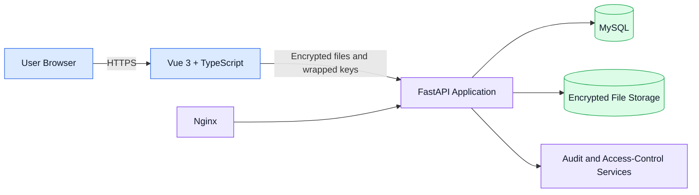

# SecureView

> A secure file encryption and sharing platform developed as a four-person Final Year Project at Monash University Malaysia.

## Overview

SecureView is a web application for encrypting, storing, sharing, and auditing access to sensitive files. The project explores how browser-side cryptography, strong authentication, fine-grained authorization, and dependable deployment practices can work together in a complete system.

The platform is being built by a four-person student team at **Monash University Malaysia**. This public repository is a portfolio overview only: it documents the product, architecture, security approach, and my individual contributions without publishing the private assessment repository or operational infrastructure details.

## Key Features

- Client-side authenticated file encryption before upload
- Secure file sharing through recipient-specific wrapped file keys
- Controlled access and revocation for owners and authorised recipients
- Integrity verification for stored encrypted content
- Account authentication, session handling, and role-based access control
- Security-sensitive activity tracking and tamper-evident audit design
- Responsive browser interface for upload, download, sharing, and account workflows

## Architecture

At a high level, the Vue frontend handles user interaction and browser-side cryptographic operations. The FastAPI backend validates requests, applies authentication and authorization rules, coordinates application services, and stores encrypted content and related metadata. MySQL provides structured persistence, while Nginx and Linux support the deployed web service.

## Security Design

- **AES-GCM** and **ChaCha20-Poly1305** provide authenticated encryption for file content.
- A fresh data-encryption key is generated for each file.
- **RSA-OAEP with SHA-256** wraps file keys for the owner and authorised recipients.
- **Argon2id** is used for password hashing and passphrase-based key derivation where appropriate.
- Plaintext files and unwrapped file keys are kept out of normal server-side storage flows.
- Access-control checks, integrity verification, and audit records provide defence in depth.

SecureView is an academic prototype, not a claim of independently audited production security.

## My Contributions

My work has focused on turning the team's security design into a testable, deployable, and clearly documented system:

- Designed and maintained test coverage and system-verification workflows
- Configured and improved deployment workflows across Linux, Nginx, Docker, and application services
- Produced and synchronised technical documentation for architecture, security flows, testing, and deployment
- Integrated security controls across frontend, backend, database, and operational boundaries
- Implemented and refined selected frontend and backend features, including file and sharing workflows
- Investigated cross-layer defects and verified fixes against application behaviour and deployment evidence

## Tech Stack

| Area | Technologies |
|---|---|
| Frontend | Vue 3, TypeScript |
| Backend | FastAPI, Python |
| Database | MySQL |
| Cryptography | AES-GCM, ChaCha20-Poly1305, RSA-OAEP, Argon2id |
| Infrastructure | Nginx, Linux, Docker |

## Live Demo

Visit **[https://secureview.tech](https://secureview.tech)** to view the current project deployment.

The live environment is provided for demonstration and may change as the Final Year Project progresses.

## Screenshots

Screenshots will be added here using demonstration accounts and fabricated data only.

| Dashboard | Encrypt and Upload |
|---|---|
| _Screenshot coming soon_ | _Screenshot coming soon_ |

| Share and Revoke | Audit History |
|---|---|
| _Screenshot coming soon_ | _Screenshot coming soon_ |

## Source Code Availability

The main source repository remains private while this university team project is under active assessment. This portfolio repository intentionally contains no private source code, credentials, private repository links, server addresses, or internal deployment details.

Additional implementation material may be shared later when academic and team requirements allow.

---

**Project:** SecureView · **Institution:** Monash University Malaysia · **Team:** Four students
