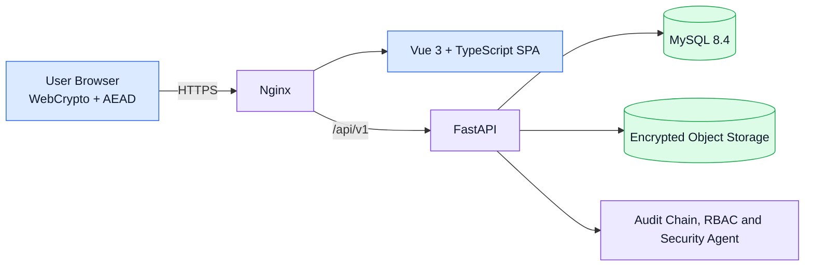

# SecureView

**English** · [中文](README.zh-CN.md)

> A secure file encryption and sharing platform developed by the four-person **FIT3161/FIT3162 MCS21** Final Year Project team at Monash University Malaysia.

## Overview

SecureView is a web application for encrypting, storing, sharing, and auditing access to sensitive files. Files are encrypted in the browser before upload, so the server only ever stores ciphertext, public keys, encrypted private-key bundles, and wrapped file keys. A user's passphrase, plaintext private key, file keys, and plaintext files never appear in an API request or a database row.

The browser MVP works end to end at [secureview.tech](https://secureview.tech), and the live API can be inspected in [Swagger UI](https://secureview.tech/docs). The remaining work is production hardening rather than unfinished features.

This public repository is a portfolio overview only. It documents the product, architecture, security approach, testing evidence, and my individual contributions without publishing the private assessment repository or operational infrastructure details.

## Key Features

- **Client-side authenticated encryption** with six selectable AEAD suites per file: AES-128/192/256-GCM, AES-256-GCM-SIV, ChaCha20-Poly1305 and XChaCha20-Poly1305 (AES-256-GCM by default)
- **Key wrapping and sharing** by re-wrapping the file key to the recipient's RSA public key, with recipient and key-fingerprint confirmation before sharing
- **Revocation** of future server-mediated access, plus per-file access history
- **Integrity verification**: SHA-256 checks before every download, a daily integrity sweep, and an admin Integrity view with single-file restore from backup
- **Tamper-evident audit log** with hash chaining, verifiable by administrators
- **Role-based access control** (USER, ADMIN, RECOVERY_OFFICER) with an offline-governed recovery workflow
- **Security agent**: a rule-based, read-only admin view that ranks findings from the audit log, integrity checks and recovery requests, with evidence and a recommended action
- **Help assistant**: answers how-to and "why not Google Drive / WhatsApp" questions entirely in the browser, with no language model and no network call
- **Encryption evidence in the UI**: the upload page shows each real encryption step with measured timings, and an encrypted preview shows what the server actually stores
- **Bilingual interface** (English and Simplified Chinese), responsive layouts for phones, and public Education, Help and Contact pages

## Architecture

The Vue frontend handles user interaction and all cryptographic operations on file content and keys. The FastAPI backend validates requests, authenticates and authorises actors, runs each use case in a transaction, appends audit records, and stores ciphertext and metadata. It never decrypts users' files. MySQL 8.4 runs under a least-privilege runtime account whose audit-log rights are limited to SELECT and INSERT.

## Security Design

- A fresh data-encryption key (DEK) is generated in the browser for each file and used with an authenticated encryption suite.
- **RSA-OAEP with SHA-256** wraps each DEK for the owner and every authorised recipient.
- **Argon2id** hashes login passwords on the server and, separately, derives the key-encryption key from the encryption passphrase in the browser. The login password and the encryption passphrase are distinct secrets.
- A forgotten passphrase is recovered only with the user's separately kept private-key file; administrators cannot reset it.
- Audit records are hash-chained, so editing or deleting history is detectable.
- A self-assessed threat model documents what the design does and does not defend against, including upload-abuse limits and malware warnings for shared executables (the server holds only ciphertext and cannot scan it).

SecureView is an academic prototype, not a claim of independently audited production security.

## Testing and Verification

Testing on this project was built to find real failures, and it did. Every number below comes from the team repository's test reports, changelog and performance records.

### Automated test suites

- **503 backend unit tests and 810 frontend tests** pass on the current main branch. The full backend suite against real MySQL 8.4 (633 tests, including integration) runs at about **85% branch coverage**; CI fails below 78% for the unit suite and 82% for the MySQL suite.
- **Live end-to-end suites** run the browser's own crypto, API clients and key handling over real HTTP against a disposable API and MySQL 8.4: registration with an emailed code, refresh-token rotation and replay detection, unlock, all six ciphers, sharing and revocation, audit visibility, role denial and account deletion. CI fails if a single test is skipped.
- **Real-browser tests**: Playwright drives Chromium through the built pages on the whole golden path (register, verify, upload, unlock, download and compare byte for byte, share, revoke, log out), with no sleeps and flaky tests counted as failures. Three more specs check phone widths at 360 px and 320 px.
- **Concurrency tests** release real threads on separate MySQL connections at once against session limits, the audit hash chain, key rewraps, duplicate shares and recovery races. Each was validated by removing the row lock it depends on and confirming the test then fails.
- **Fault injection** kills the database connection at commit after the ciphertext is written, makes the object store refuse writes, and sends truncated envelopes and forged signatures.
- **Cryptographic test vectors**: the AEAD suites are checked byte for byte against OpenSSL, libsodium and the RFC 8452 vectors, shared by the browser, backend and load tool.
- **Report hygiene**: CI artifacts are scanned for keys, tokens and fixture plaintext before upload, and Playwright traces are never published.

### CI and release gates

Five jobs run on every pull request on self-hosted runners isolated from production: backend, frontend, a **MySQL 8.4 release gate** (migrations from empty, grant boundaries, schema parity, refusal on non-empty databases, concurrent-migration locks, and a backup and restore drill), **live end-to-end** tests, and an **isolated tamper drill**. Only commits that pass CI are deployed.

### Capacity and performance

At the supervisor's request for numbers rather than claims, a load tool that encrypts and decrypts exactly like the browser was run against staging on 3–4 October 2026:

- **22,264 operations**, with **5,094 downloads** decrypted and SHA-256-compared to the original and **0 integrity failures**.
- pdf, png, jpg, mp4, zip and exe files from 1 MB to **500 MB** all round-tripped byte-exact (144 of 144).
- 5 users on a mixed load for 108 minutes (19,372 operations) and up to 50 concurrent users with no server error.
- At 100 users, 65–78% of uploads failed while CPU averaged 3%. The cause was traced to uploads holding a database connection while waiting for a thread pool whose threads were waiting for connections. After the fix, failed uploads at 100 users dropped from **80% to 0%** and throughput rose from **0.33 to 56 operations per second**, and the staging re-run passed 102 of 102 uploads.
- The service recovered to zero errors on its own after each overload, and each of the three deliberate overloads triggered exactly one monitoring alert email.

### Bugs found by testing

- The load tool's dry run found **two MySQL deadlocks** that only appear under concurrency. A regression test reproduced one about 7 times in 10 before the fix and never after, and 28,540 requests on staging that night produced no deadlock.
- The database-pool exhaustion at 100 users described above.
- A layout-audit script that measures about 100 page views in five configurations found that Access Records made a forbidden request on every visit; it now reports zero errors.

### Security testing

- **OWASP ZAP** baseline scan of the live site: no high-risk issue (0 FAIL, 8 WARN, 59 PASS). It found missing security headers on the static bundle, which were fixed in Nginx.
- **pip-audit and npm audit**: no findings in production dependencies.
- **Tamper testing**: an attacker container in CI and a live, scripted demonstration both change stored ciphertext and confirm the download is refused. Rewriting the recorded SHA-256 as well is still caught by the AEAD tag and the hash-chained audit log.
- **Backups**: encrypted off-server backups of metadata and ciphertext, verified by a clean-host restore drill.

## My Contributions

As of **6 October 2026** I authored **137 of the repository's 158 merged pull requests** (145 authored in total) and opened **29 issues**. My work spans the full delivery path, from implementation and security features to testing, deployment, operations, and project evidence.

### Testing and Quality Engineering

- Wrote the load and capacity testing tool, ran the staging capacity study, diagnosed the database-pool failure at 100 users and fixed it, and fixed the two MySQL deadlocks the tool found, with a regression test.
- Built the CI quality gates and the MySQL 8.4 release gate, the live end-to-end stack with zero-skip enforcement, MySQL concurrency and fault-injection suites, and the Playwright golden-path test in Chromium.
- Built the isolated VPS adversarial tamper drill, real-browser tamper acceptance tests, and the scripted live tamper demonstration.
- Added phone-width browser tests and the layout and text audit scripts used to check every page in both languages.
- Ran the OWASP ZAP, pip-audit and npm audit scans and fixed the security headers they flagged.
- Earlier, opened the testing track and covered the complete encrypted-file lifecycle against a live backend, uncovering and fixing issues in audit visibility, session behaviour, sharing and storage consistency.

### Security and Product Features

- Added AES-256-GCM-SIV and XChaCha20-Poly1305, giving six AEAD choices per file, with per-suite nonce checks and Education content.
- Built the **security agent** (v1 and v2): ranked findings with evidence, de-duplicated incidents, daily alerts and detection of sign-in after password guessing.
- Built the **integrity and recovery** pipeline: daily integrity sweep, audit-anchored digests, the admin Integrity tab, and single-file restore from backup.
- Implemented upload-abuse limits and shared-executable warnings, and recipient key-fingerprint confirmation before sharing, from the threat-model register.
- Built the in-browser **Help assistant** (v1 and v2), the English / Simplified Chinese interface, the admin console and account details with login-password reset, the file details panel, and the encrypted preview and live encryption-step view.
- Earlier core flows: browser download and decryption, recipient key re-wrapping, private-key-file unlock, idle relock, session renewal, account deletion, server-side filename search, and audit visibility by ownership.

### Deployment and Operations

- Built and maintained the guarded automatic deployment of exact, CI-passed commits, with health checks, failed-release quarantine and stalled-build recovery.
- Deployed and hardened the Linux host: Nginx, HTTPS/TLS, security headers, rate limiting and fail2ban.
- Added encrypted off-server backups with a clean-host restore drill, stale-data reconciliation, failure alerts, and redacted observability with external audit checkpoints.

### Documentation and Coordination

- Established and maintained the shared bilingual changelog and kept architecture, API, security, threat-model, testing, performance, deployment, README and TODO documentation in sync.
- Built the team delivery board and the proposal traceability record, and wrote the final-presentation talking points, demo script, tamper-demo script and reflection.

## Tech Stack

| Area | Technologies |
|---|---|
| Frontend | Vue 3, TypeScript, Vite, WebCrypto |
| Backend | FastAPI, Python, Pydantic, SQLAlchemy, Alembic |
| Database | MySQL 8.4 |
| Cryptography | AES-GCM, AES-GCM-SIV, (X)ChaCha20-Poly1305, RSA-OAEP, Argon2id, SHA-256 |
| Testing | pytest, Vitest, Playwright, custom load-testing tool, OWASP ZAP, pip-audit, npm audit |
| Infrastructure | Linux, Nginx, Docker, systemd, GitHub Actions (self-hosted runners) |

## Live Site

Visit **[https://secureview.tech](https://secureview.tech)** (always use the `https://` prefix). The platform is live and open to try, and it may keep changing as the Final Year Project progresses.

## Screenshots

Screenshots below use a demonstration account and fabricated data, to keep real user files and activity out of this public repository. Some predate the latest interface redesign.

| Dashboard | Upload and Encrypt |
|---|---|
|  |  |

| Share and Revoke | Audit History |
|---|---|
|  |  |

## Source Code Availability

The main source repository remains private while this university team project is under active assessment. This portfolio repository intentionally contains no private source code, credentials, private repository links, server addresses, or internal deployment details.

Additional implementation material may be shared later when academic and team requirements allow.

---

**Project:** SecureView · **Institution:** Monash University Malaysia · **Units:** FIT3161 / FIT3162 · **Team:** MCS21 · **Team size:** Four students
