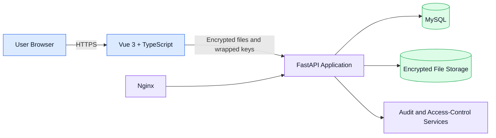

# SecureView

> A secure file encryption and sharing platform developed by the four-person **FIT3162 MCS21** Final Year Project team at Monash University Malaysia.

## Overview

SecureView is a web application for encrypting, storing, sharing, and auditing access to sensitive files. The project explores how browser-side cryptography, strong authentication, fine-grained authorization, and dependable deployment practices can work together in a complete system.

The platform is being built by the four-person **FIT3162 MCS21** student team at **Monash University Malaysia**. This public repository is a portfolio overview only: it documents the product, architecture, security approach, and my individual contributions without publishing the private assessment repository or operational infrastructure details.

## Key Features

- Client-side authenticated file encryption before upload
- Secure file sharing through recipient-specific wrapped file keys
- Controlled access and revocation for owners and authorised recipients
- Integrity verification for stored encrypted content
- Account authentication, session handling, and role-based access control
- Security-sensitive activity tracking and tamper-evident audit design
- Responsive browser interface for upload, download, sharing, and account workflows

## Architecture

At a high level, the Vue frontend handles user interaction and browser-side cryptographic operations. The FastAPI backend validates requests, applies authentication and authorization rules, coordinates application services, and stores encrypted content and related metadata. MySQL provides structured persistence, while Nginx and Linux support the deployed web service.

## Security Design

- **AES-GCM** and **ChaCha20-Poly1305** provide authenticated encryption for file content.
- A fresh data-encryption key is generated for each file.
- **RSA-OAEP with SHA-256** wraps file keys for the owner and authorised recipients.
- **Argon2id** is used for password hashing and passphrase-based key derivation where appropriate.
- Plaintext files and unwrapped file keys are kept out of normal server-side storage flows.
- Access-control checks, integrity verification, and audit records provide defence in depth.

SecureView is an academic prototype, not a claim of independently audited production security.

## My Contributions

My work spans the full delivery path—from implementation and security integration to testing, deployment, incident diagnosis, and project evidence.

### Deployment and Infrastructure

- Built and maintained the guarded automatic deployment workflow for `main`, including exact-commit releases, health checks, rollback behaviour, failed-release quarantine, and service automation.
- Deployed and hardened the application on Linux with Nginx, HTTPS/TLS, security headers, request controls, and operational health verification.
- Diagnosed live cross-layer failures involving release permissions, deployment probes, application dependencies, audit verification, documentation access, and upload-size configuration drift.
- Developed operational safeguards for database verification, encrypted-file storage, stale-data reconciliation, and deployment recovery.

### Testing and Quality Assurance

- Built real MySQL 8.4 integration and release-gate coverage for migrations, constraints, privileges, schema drift, TLS, and safe deployment behaviour.
- Created tests for the complete encrypted-file lifecycle, including upload, storage, download, decryption, integrity failure, sharing, revocation, and audit visibility.
- Exercised the complete MVP against a live backend and maintained automated frontend, backend, type-checking, build, lint, and dependency-verification workflows.
- Performed extensive manual and live testing that uncovered and drove fixes for filename validation, large-transfer feedback, stale shared-file access, sharing UX, session behaviour, and audit results.
- Created safe staging test-account tooling and runbooks without committing credentials or private keys.

### Security and Product Engineering

- Integrated emailed verification and password-reset flows with browser-side account-key enrolment and separation between login credentials and encryption secrets.
- Implemented or refined client key handling, session refresh and idle relock, private-key-file recovery, recipient-specific key rewrapping, access revocation, and audit-visibility rules.
- Delivered frontend and backend improvements across file search and pagination, encrypted download/decryption, file ownership views, access history, share management and notifications, account actions, and audit presentation.
- Fixed security- and reliability-relevant issues across MySQL verification, authentication throttling, dependency declarations, API contracts, storage consistency, and server configuration.

### Documentation and Project Coordination

- Established and maintained the shared bilingual changelog and synchronised architecture, API, security, testing, database, deployment, README, and TODO documentation.
- Built the shared delivery board and reconciled Issues, PRs, commits, milestones, acceptance criteria, deployment evidence, and individual contribution records.
- Wrote evaluation and operator guidance so teammates and assessors could verify the system without access to private infrastructure credentials.

### Contribution Snapshot

As of **12 September 2026**, the private project history records:

- **55 pull requests authored**, including **51 merged**
- **111 authored commits on `main`**, comprising **60 non-merge commits** and **51 merge commits**

These counts are included as a dated evidence snapshot because the active project continues to evolve.

## Tech Stack

| Area | Technologies |
|---|---|
| Frontend | Vue 3, TypeScript |
| Backend | FastAPI, Python |
| Database | MySQL |
| Cryptography | AES-GCM, ChaCha20-Poly1305, RSA-OAEP, Argon2id |
| Infrastructure | Nginx, Linux, Docker |

## Live Demo

Visit **[https://secureview.tech](https://secureview.tech)** to view the current project deployment.

The live environment is provided for demonstration and may change as the Final Year Project progresses.

## Screenshots

Screenshots will be added here using demonstration accounts and fabricated data only.

| Dashboard | Encrypt and Upload |
|---|---|
| _Screenshot coming soon_ | _Screenshot coming soon_ |

| Share and Revoke | Audit History |
|---|---|
| _Screenshot coming soon_ | _Screenshot coming soon_ |

## Source Code Availability

The main source repository remains private while this university team project is under active assessment. This portfolio repository intentionally contains no private source code, credentials, private repository links, server addresses, or internal deployment details.

Additional implementation material may be shared later when academic and team requirements allow.

---

**Project:** SecureView · **Institution:** Monash University Malaysia · **Team:** FIT3162 MCS21 · **Team size:** Four students
