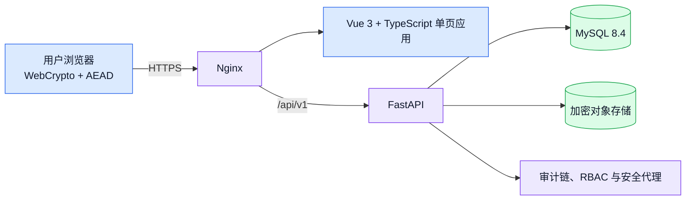
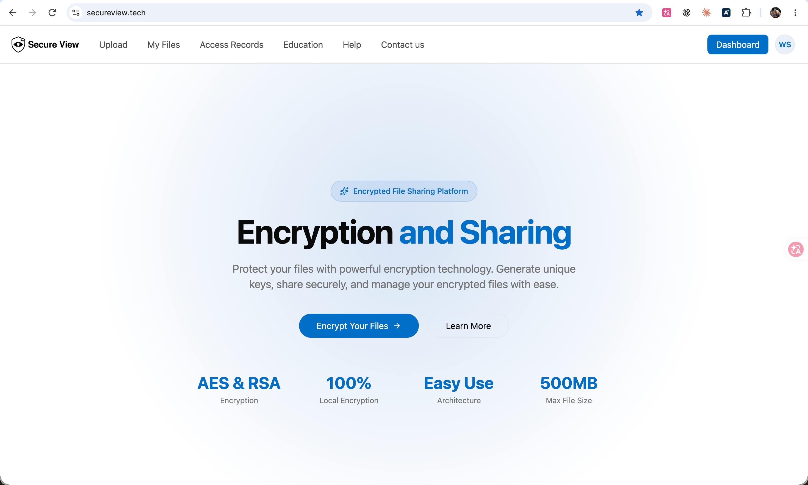
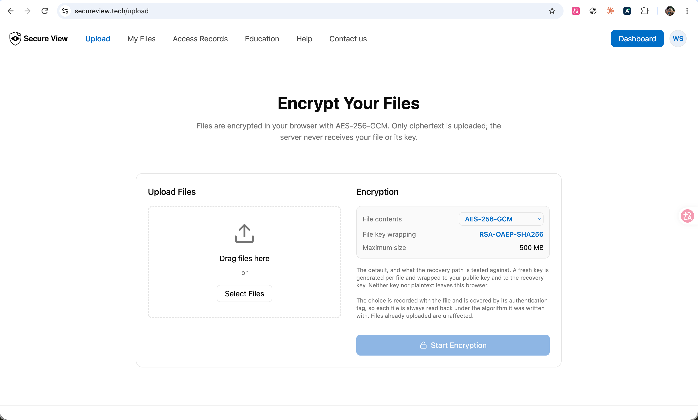
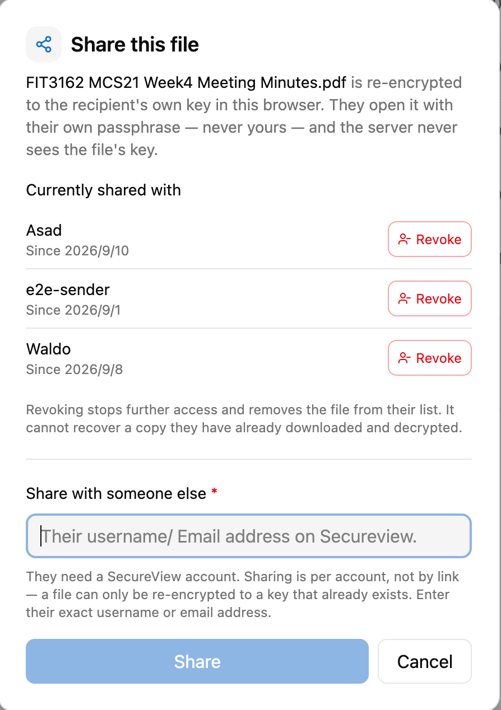
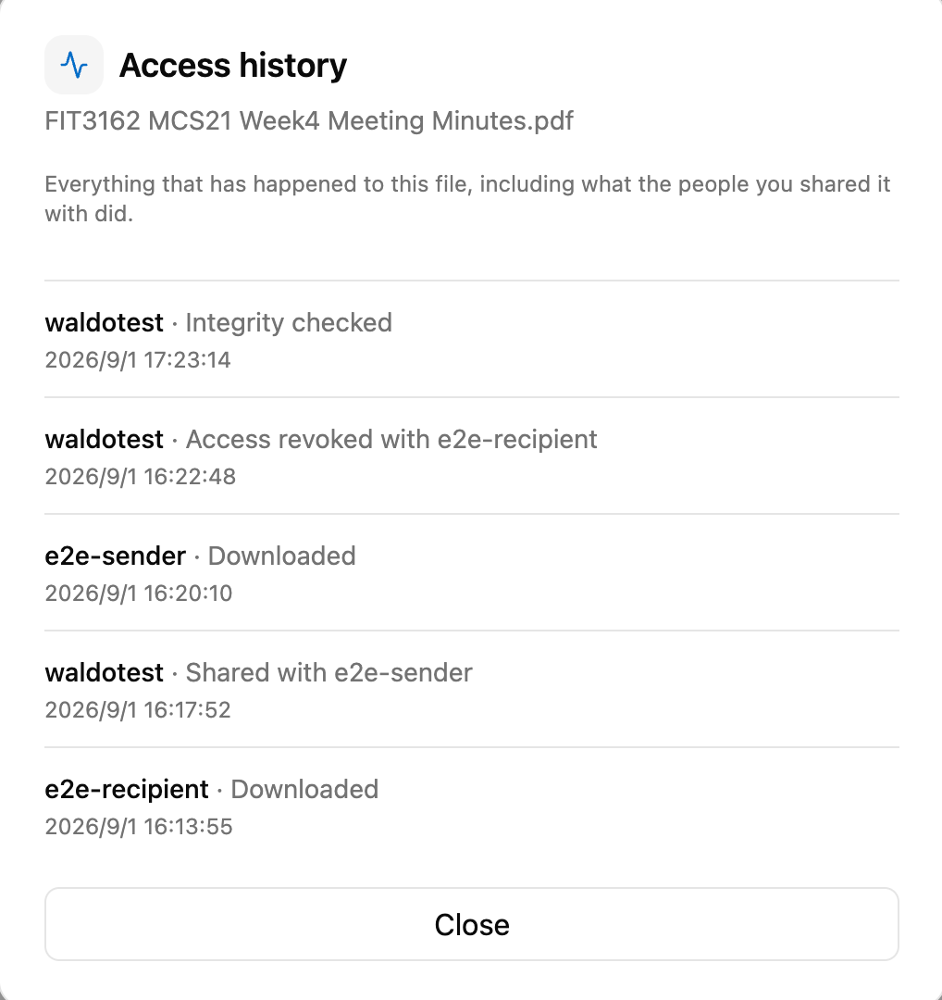

# SecureView

[English](README.md) · **中文**

> 一个安全文件加密与共享平台，由 Monash University Malaysia **FIT3161/FIT3162 MCS21** 四人毕业设计小组开发。

## 项目概览

SecureView 是一个用于加密、存储、共享和审计敏感文件访问的 Web 应用。文件在上传前就已在浏览器里加密，服务器只保存密文、公钥、加密后的私钥包和被包裹的文件密钥。用户的口令、明文私钥、文件密钥和明文文件，永远不会出现在任何 API 请求或数据库记录里。

浏览器端 MVP 已在 [secureview.tech](https://secureview.tech) 端到端可用，线上 API 可以在 [Swagger UI](https://secureview.tech/docs) 里直接查看。剩下的工作是生产级加固，而不是没做完的功能。

这个公开仓库只是作品集概览：介绍产品、架构、安全思路、测试证据和我个人的贡献，不公开私有的评估仓库，也不包含运维基础设施细节。

## 核心功能

- **浏览器端认证加密**：每个文件可选六种 AEAD 方案：AES-128/192/256-GCM、AES-256-GCM-SIV、ChaCha20-Poly1305 和 XChaCha20-Poly1305（默认 AES-256-GCM）
- **密钥包裹与共享**：把文件密钥重新包裹给接收者的 RSA 公钥；共享前确认接收者及其密钥指纹
- **撤销访问**：停止后续经服务器的访问，并提供每个文件的访问记录
- **完整性校验**：每次下载前做 SHA-256 校验，每日完整性巡检，管理员 Integrity 页面支持从备份恢复单个文件
- **防篡改审计日志**：哈希链结构，管理员可整体校验
- **基于角色的访问控制**（USER、ADMIN、RECOVERY_OFFICER），配合离线管控的恢复流程
- **安全代理（Security agent）**：基于规则、只读的管理员视图，从审计日志、完整性检查和恢复请求中给出分级发现，附证据和建议操作
- **帮助助手**：在浏览器内回答操作类问题以及"为什么不用 Google Drive / WhatsApp"这类问题，不用大模型、不发任何网络请求
- **界面里看得见的加密证据**：上传页展示每个真实加密步骤及耗时，加密预览展示服务器实际保存的内容
- **中英双语界面**、手机适配，以及公开的教学、帮助和联系页面

## 架构

Vue 前端负责用户交互，以及所有针对文件内容和密钥的加密运算。FastAPI 后端负责校验请求、认证与授权、在事务中执行每个用例、追加审计记录、保存密文和元数据，但从不解密用户文件。MySQL 8.4 使用最小权限的运行账户，对审计日志只有 SELECT 和 INSERT 权限。

## 安全设计

- 每个文件在浏览器里生成独立的数据加密密钥（DEK），配合认证加密方案使用。
- **RSA-OAEP（SHA-256）** 为文件所有者和每个授权接收者包裹 DEK。
- **Argon2id** 在服务器端哈希登录密码，并在浏览器端从加密口令派生密钥加密密钥。登录密码和加密口令是两个独立的秘密。
- 忘记加密口令只能用用户自己另行保存的私钥文件找回，管理员无法重置。
- 审计记录采用哈希链，修改或删除历史都能被发现。
- 自评的威胁模型写明了设计能防什么、不能防什么，包括上传滥用限制，以及对共享可执行文件的恶意软件提醒（服务器只保存密文，无法扫描）。

SecureView 是学术原型，不代表经过独立审计的生产级安全。

## 测试与验证

这个项目的测试是为了真正找出问题而做的，也确实找出了问题。下面的数字都来自团队仓库的测试报告、changelog 和性能记录。

### 自动化测试

- 当前 main 分支上 **503 个后端单元测试和 810 个前端测试**全部通过。连接真实 MySQL 8.4 的完整后端测试（633 个，含集成测试）分支覆盖率约 **85%**；CI 要求单元测试不低于 78%、MySQL 测试不低于 82%，否则失败。
- **线上端到端测试**：在一次性的 API 和 MySQL 8.4 上，通过真实 HTTP 跑浏览器自己的加密代码、API 客户端和密钥处理：邮件验证码注册、refresh token 轮换与重放检测、解锁、全部六种加密方案、共享与撤销、审计可见性、越权拒绝和账户删除。只要有一个测试被跳过，CI 就判定失败。
- **真实浏览器测试**：Playwright 驱动 Chromium 在构建好的页面上走完整主流程（注册、验证、上传、解锁、下载并逐字节比对、共享、撤销、退出），不用任何 sleep，偶发通过也算失败。另有三组用例检查 360 px 和 320 px 手机宽度。
- **并发测试**：用屏障同时释放多个线程，各自使用独立 MySQL 连接，冲击会话上限、审计哈希链、密钥重新包裹、重复共享和恢复流程的竞态。每个用例都做过验证：去掉它依赖的行锁后，测试确实会失败。
- **故障注入**：在密文写入后的提交时刻断开数据库连接、让对象存储拒绝写入，以及发送截断的信封和伪造的签名。
- **密码学测试向量**：各 AEAD 方案与 OpenSSL、libsodium 和 RFC 8452 的测试向量逐字节比对，浏览器、后端和压测工具共用同一套向量。
- **报告卫生检查**：CI 产物上传前会扫描其中是否含有密钥、令牌和测试明文，Playwright trace 一律不发布。

### CI 与发布闸门

每个 PR 在与生产隔离的自托管 runner 上跑五个任务：后端、前端、**MySQL 8.4 发布闸门**（从空库跑全部迁移、权限边界、表结构一致性、拒绝在非空库上安装、并发迁移锁、备份与恢复演练）、**线上端到端测试**，以及**隔离的篡改演练**。只有通过 CI 的提交才会部署。

### 容量与性能

导师要求用数字说话而不是"支持很多用户"，于是我们用一个加解密方式与浏览器完全一致的压测工具，在 2026 年 10 月 3–4 日对预发布环境做了完整测试：

- 共 **22,264 次操作**，其中 **5,094 次下载**全部解密并与原文件做 SHA-256 比对，**完整性失败为 0**。
- pdf、png、jpg、mp4、zip、exe 从 1 MB 到 **500 MB** 全部往返后逐字节一致（144/144）。
- 5 个用户混合负载持续 108 分钟（19,372 次操作），以及 50 个并发用户以内，服务器均无错误。
- 100 个用户时有 65–78% 的上传失败，而 CPU 平均只有 3%。最终定位到原因：上传在等待线程池时占着数据库连接，而线程池里的线程又都在等连接。修复后，100 用户时的上传失败率从 **80% 降到 0%**，吞吐从 **每秒 0.33 次提升到 56 次**，预发布环境复测 102 次上传全部成功。
- 每次过载结束后服务都自行恢复到零错误，三次刻意制造的过载各触发了一封监控告警邮件。

### 测试发现的真实问题

- 压测工具的本地试跑发现了**两个只在并发下出现的 MySQL 死锁**。修复前回归测试大约 10 次能复现 7 次，修复后再未出现；当晚预发布环境 28,540 次请求没有一次死锁。
- 上面提到的 100 用户时数据库连接池耗尽。
- 一个在五种配置下测量约 100 个页面视图的布局审计脚本发现，访问记录页每次打开都会发出一个无权限的请求；修复后报告零错误。

### 安全测试

- **OWASP ZAP** 对线上站点的基线扫描：没有高风险问题（0 FAIL、8 WARN、59 PASS）。它发现静态资源缺少安全响应头，已在 Nginx 中修复。
- **pip-audit 和 npm audit**：生产依赖中没有发现问题。
- **篡改测试**：CI 中的攻击者容器和脚本化的线上演示都会修改存储的密文，并确认下载被拒绝；即使同时改掉记录的 SHA-256，也会被 AEAD 认证标签和哈希链审计日志拦下。
- **备份**：元数据与密文的加密异地备份，用干净主机恢复演练来验证。

## 我的贡献

截至 **2026 年 10 月 6 日**，仓库共合并 158 个 PR，其中 **137 个由我提交**（我共提交 145 个），另外我开了 **29 个 issue**。我的工作覆盖完整交付链路：从功能实现与安全特性，到测试、部署、运维和项目证据。

### 测试与质量工程

- 编写负载与容量测试工具，完成预发布环境容量测试，定位并修复 100 用户时的数据库连接池故障，并修复工具发现的两处 MySQL 死锁，附回归测试。
- 搭建 CI 质量闸门和 MySQL 8.4 发布闸门、强制零跳过的线上端到端测试环境、MySQL 并发与故障注入测试，以及 Chromium 上的 Playwright 主流程测试。
- 搭建隔离的 VPS 对抗性篡改演练、真实浏览器篡改验收测试，以及脚本化的线上篡改演示。
- 增加手机宽度的浏览器测试，以及用来检查中英文所有页面的布局与文字审计脚本。
- 运行 OWASP ZAP、pip-audit 和 npm audit 扫描，并修复扫描指出的安全响应头问题。
- 早期开启测试工作线，针对线上后端覆盖完整的加密文件生命周期，发现并修复了审计可见性、会话行为、共享和存储一致性方面的问题。

### 安全与产品功能

- 新增 AES-256-GCM-SIV 和 XChaCha20-Poly1305，使每个文件可选六种 AEAD 方案，并按方案校验 nonce 长度、补充教学内容。
- 开发了**安全代理**（v1、v2）：分级发现与证据、同一事件去重、每日告警，以及"猜测密码后登录成功"的检测。
- 搭建了**完整性与恢复**链路：每日完整性巡检、锚定在审计日志里的摘要、管理员 Integrity 页面，以及从备份恢复单个文件。
- 根据威胁模型清单实现了上传滥用限制和共享可执行文件提醒，以及共享前确认接收者密钥指纹。
- 开发了浏览器内的**帮助助手**（v1、v2）、中英文界面、管理员控制台与账户详情及登录密码重置、文件详情面板，以及加密预览和实时加密步骤展示。
- 早期核心流程：浏览器端下载与解密、为接收者重新包裹密钥、私钥文件解锁、空闲自动锁定、会话续期、账户删除、服务器端文件名搜索，以及按所有权决定审计可见性。

### 部署与运维

- 搭建并维护受保护的自动部署：只部署通过 CI 的指定提交，带健康检查、失败版本隔离和卡住构建的恢复。
- 部署并加固 Linux 主机：Nginx、HTTPS/TLS、安全响应头、限流和 fail2ban。
- 加入加密异地备份与干净主机恢复演练、过期数据清理、失败告警，以及脱敏的可观测性和外部审计检查点。

### 文档与协作

- 建立并维护团队共用的中英双语 changelog，保持架构、API、安全、威胁模型、测试、性能、部署、README 和 TODO 文档同步。
- 搭建团队交付看板和提案追溯记录，撰写期末答辩要点、演示脚本、篡改演示脚本和项目反思。

## 技术栈

| 领域 | 技术 |
|---|---|
| 前端 | Vue 3、TypeScript、Vite、WebCrypto |
| 后端 | FastAPI、Python、Pydantic、SQLAlchemy、Alembic |
| 数据库 | MySQL 8.4 |
| 密码学 | AES-GCM、AES-GCM-SIV、(X)ChaCha20-Poly1305、RSA-OAEP、Argon2id、SHA-256 |
| 测试 | pytest、Vitest、Playwright、自研压测工具、OWASP ZAP、pip-audit、npm audit |
| 基础设施 | Linux、Nginx、Docker、systemd、GitHub Actions（自托管 runner） |

## 在线站点

访问 **[https://secureview.tech](https://secureview.tech)**（请带上 `https://` 前缀）。平台已上线、任何人都可以试用，随着毕业设计推进可能还会继续变化。

## 截图

以下截图使用演示账户和虚构数据，避免在公开仓库中出现真实用户文件和操作记录。部分截图早于最新一版界面改版。

| 仪表盘 | 上传与加密 |
|---|---|
|  |  |

| 共享与撤销 | 审计记录 |
|---|---|
|  |  |

## 源码开放情况

主源码仓库在这个大学团队项目评估期间保持私有。本作品集仓库刻意不包含私有源码、凭据、私有仓库链接、服务器地址或内部部署细节。

在学校和团队要求允许的情况下，之后可能会公开更多实现材料。

---

**项目：** SecureView · **学校：** Monash University Malaysia · **课程：** FIT3161 / FIT3162 · **团队：** MCS21 · **团队人数：** 四人
