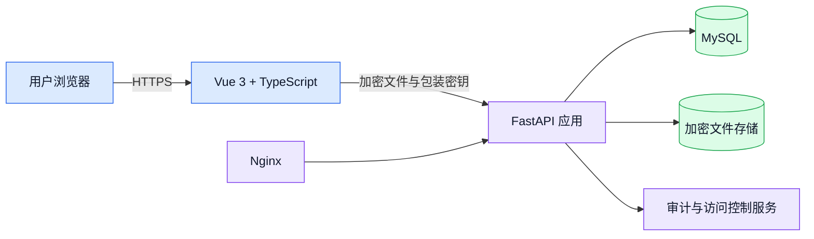

# SecureView

> 一个安全文件加密与共享平台，由 Monash University Malaysia **FIT3162 MCS21** 四人毕业设计小组开发。

## 项目概览

SecureView 是一个用于加密、存储、共享和审计敏感文件访问记录的 Web 应用。这个项目探索了浏览器端加密、强身份验证、细粒度授权和可靠部署实践如何在一个完整系统中协同工作。

这个平台由 Monash University Malaysia 的 **FIT3162 MCS21** 四人小组开发。这个公开仓库只是一份作品集概览：记录产品、架构、安全方案和我个人的贡献，不包含私有的评估仓库或运维基础设施细节。

## 核心功能

- 上传前完成客户端认证加密
- 通过接收者专属的包装密钥实现安全文件共享
- 所有者和授权接收者均可控制访问权限并可撤销
- 对存储的加密内容进行完整性校验
- 账户认证、会话管理与基于角色的访问控制
- 安全敏感操作追踪与防篡改审计设计
- 支持上传、下载、共享和账户操作的响应式浏览器界面

## 架构

整体来说，Vue 前端负责用户交互和浏览器端的加密操作。FastAPI 后端负责请求校验、身份认证与授权规则、协调应用服务，并存储加密内容和相关元数据。MySQL 提供结构化持久存储，Nginx 和 Linux 支撑部署好的 Web 服务。

## 安全设计

- **AES-GCM** 和 **ChaCha20-Poly1305** 为文件内容提供认证加密
- 每个文件都会生成一个全新的数据加密密钥
- **RSA-OAEP with SHA-256** 为所有者和授权接收者包装文件密钥
- **Argon2id** 用于密码哈希和基于口令的密钥派生
- 明文文件和未包装的文件密钥不会进入常规服务端存储流程
- 访问控制检查、完整性校验和审计记录共同提供纵深防御

SecureView 是一个学术原型，不代表经过独立审计的生产级安全性声明。

## 我的贡献

我的工作覆盖从实现、安全集成到测试、部署、故障排查和项目证据的完整交付链路。

### 部署与基础设施

- 构建并维护了 `main` 分支的自动化守护部署流程，包括精确提交发布、健康检查、回滚机制、失败版本隔离和服务自动化
- 在 Linux 上完成部署并加固应用，配置 Nginx、HTTPS/TLS、安全响应头、请求控制和运维健康检查
- 排查过涉及发布权限、部署探针、应用依赖、审计校验、文档访问和上传大小配置漂移等多层交叉故障
- 为数据库校验、加密文件存储、脏数据核对和部署恢复开发了运维安全机制

### 测试与质量保障

- 构建了真实的 MySQL 8.4 集成测试和发布门禁覆盖，涵盖迁移、约束、权限、schema 漂移、TLS 和安全部署行为
- 为完整的加密文件生命周期编写测试，包括上传、存储、下载、解密、完整性失败、共享、撤销和审计可见性
- 针对真实后端完整跑通 MVP，并维护自动化的前端、后端、类型检查、构建、lint 和依赖校验流程
- 进行了大量手动和实时测试，发现并推动修复了文件名校验、大文件传输反馈、失效共享文件访问、共享体验、会话行为和审计结果等问题
- 在不提交凭据或私钥的前提下，搭建了安全的预发布测试账号工具和操作手册

### 安全与产品工程

- 集成了邮件验证和密码重置流程，实现浏览器端账户密钥注册，并将登录凭据与加密密钥分离
- 实现或优化了客户端密钥处理、会话刷新与空闲重新锁定、私钥文件恢复、接收者专属密钥重新包装、访问撤销和审计可见性规则
- 在文件搜索分页、加密下载解密、文件归属视图、访问历史、共享管理与通知、账户操作和审计展示等方面交付了前后端改进
- 修复了 MySQL 校验、身份验证限流、依赖声明、API 契约、存储一致性和服务器配置中与安全和可靠性相关的问题

### 文档与项目协调

- 建立并维护了共享的双语更新日志，同步架构、API、安全、测试、数据库、部署、README 和 TODO 文档
- 搭建了共享交付看板，核对 Issue、PR、提交、里程碑、验收标准、部署证据和个人贡献记录
- 编写了评估和操作指南，让队友和评审老师无需私有基础设施凭据也能验证系统

### 贡献快照

截至 **2026 年 9 月 12 日**，私有项目历史记录显示：

- **共提交 55 个 PR**，其中 **51 个已合并**
- **在 `main` 上共提交 111 次**，其中 **60 次非合并提交**、**51 次合并提交**

这些数字作为带日期的证据快照记录在此，因为项目仍在持续推进。

## 技术栈

| 领域 | 技术 |
|---|---|
| 前端 | Vue 3, TypeScript |
| 后端 | FastAPI, Python |
| 数据库 | MySQL |
| 加密 | AES-GCM, ChaCha20-Poly1305, RSA-OAEP, Argon2id |
| 基础设施 | Nginx, Linux, Docker |

## 在线站点

访问 **[https://secureview.tech](https://secureview.tech)** —— 网站已经正式上线，任何人都可以正常使用。

后续可能会随着毕业设计的推进继续更新。

## 截图

截图会使用演示账号和虚构数据，避免在这个公开仓库里出现真实用户的文件和操作记录。

| 仪表盘 | 加密与上传 |
|---|---|
| _截图即将上传_ | _截图即将上传_ |

| 共享与撤销 | 审计历史 |
|---|---|
| _截图即将上传_ | _截图即将上传_ |

## 源码开放情况

在这个大学团队项目处于评估阶段期间，主源码仓库保持私有。这个作品集仓库刻意不包含任何私有源码、凭据、私有仓库链接、服务器地址或内部部署细节。

在学术和团队要求允许的情况下，未来可能会分享更多实现细节。

---

**项目：** SecureView · **院校：** Monash University Malaysia · **团队：** FIT3162 MCS21 · **团队人数：** 四人
